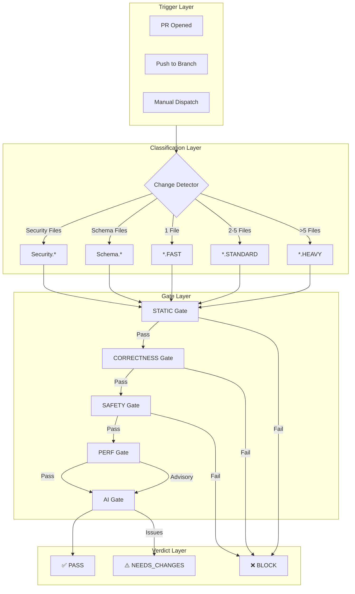
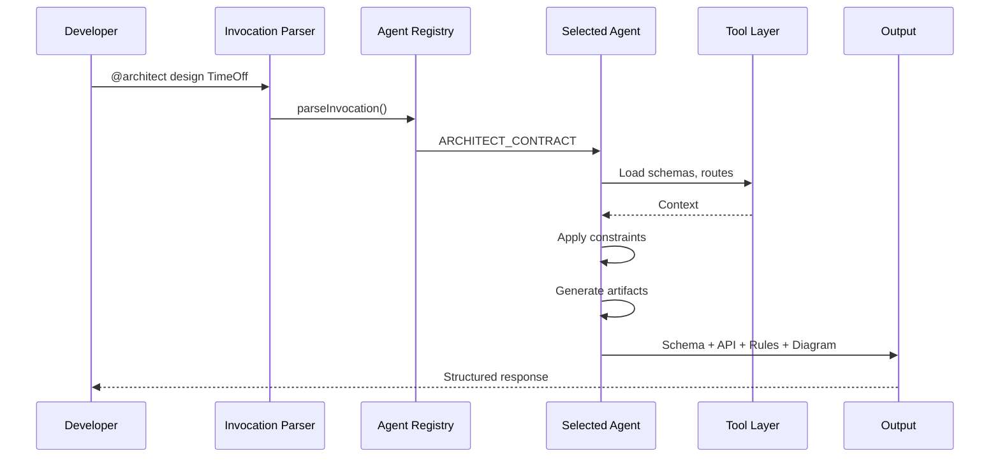
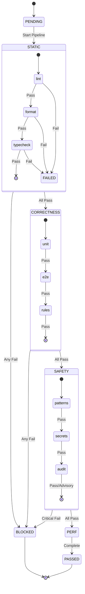
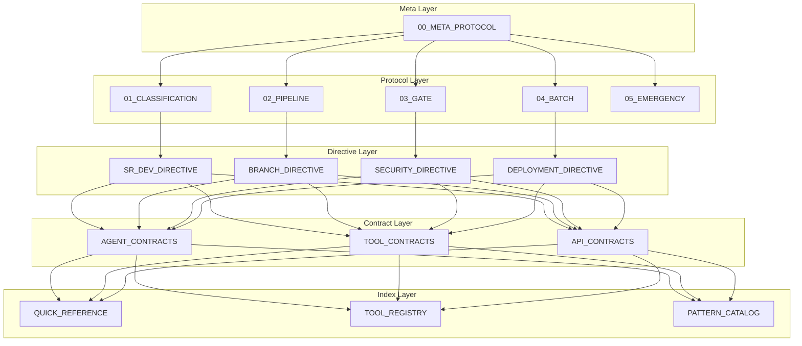
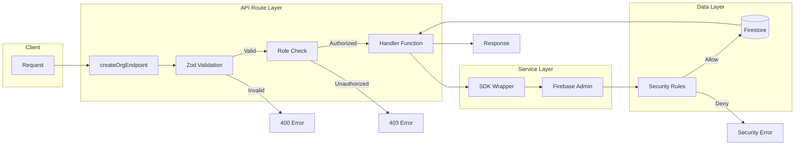
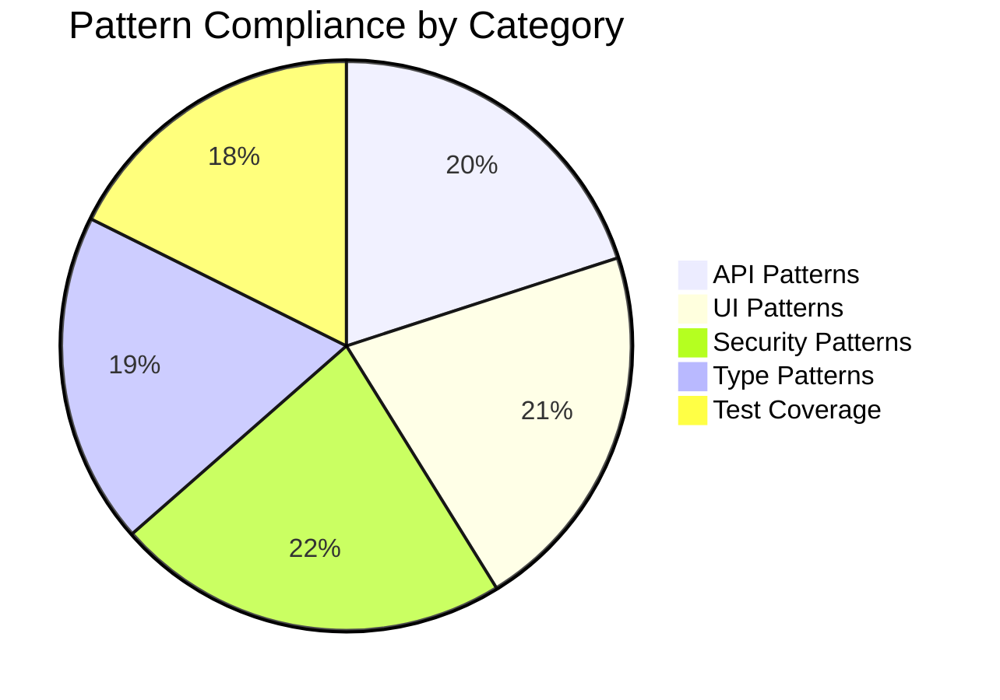

# Fresh Schedules Architecture Diagrams

## 1. New Orchestration Architecture (Post-CrewOps)



## 2. Agent Interaction Model



## 3. Gate Execution Flow



## 4. Protocol Hierarchy



## 5. Data Flow: API Route Security Pattern



## 6. Agent Decision Tree

```mermaid
flowchart TD
    Start[Receive Invocation] --> Parse{Parse Invocation}

    Parse -->|@architect| ArchQ{Has feature spec?}
    Parse -->|@refactor| RefQ{Has file path?}
    Parse -->|@guard| GuardQ{Has PR/diff?}
    Parse -->|@auditor| AuditQ{Has scope?}
    Parse -->|Unknown| Clarify[Request clarification]

    ArchQ -->|Yes| ArchLoad[Load schemas + routes]
    ArchQ -->|No| AskSpec[Ask for requirements]

    RefQ -->|Yes| RefLoad[Load file + patterns]
    RefQ -->|No| AskFile[Ask for file path]

    GuardQ -->|Yes| GuardLoad[Load diff + rules]
    GuardQ -->|No| AskPR[Ask for PR reference]

    AuditQ -->|Yes| AuditLoad[Load scope files]
    AuditQ -->|No| AuditFull[Default: full repo]

    ArchLoad --> ArchGen[Generate artifacts]
    RefLoad --> RefGen[Generate diff]
    GuardLoad --> GuardEval[Evaluate compliance]
    AuditLoad & AuditFull --> AuditScan[Scan & score]

    ArchGen --> ArchOut[Schema + API + Rules + Diagram]
    RefGen --> RefOut[Diff + Explanation]
    GuardEval --> GuardOut[Verdict + Violations]
    AuditScan --> AuditOut[Report + Metrics]
```

## 7. Branch Strategy

```mermaid
gitGraph
    commit id: "initial"
    branch dev
    checkout dev
    commit id: "dev-init"
    branch feature/FS-123-new-feature
    checkout feature/FS-123-new-feature
    commit id: "feat-1"
    commit id: "feat-2"
    checkout dev
    merge feature/FS-123-new-feature id: "squash-merge" type: HIGHLIGHT
    branch feature/FS-124-another
    checkout feature/FS-124-another
    commit id: "feat-3"
    checkout dev
    merge feature/FS-124-another id: "squash-merge-2"
    checkout main
    merge dev id: "release-1" tag: "v1.0.0" type: HIGHLIGHT
    checkout dev
    commit id: "post-release"
    checkout main
    branch hotfix/URGENT-fix
    commit id: "hotfix"
    checkout main
    merge hotfix/URGENT-fix id: "hotfix-merge" type: REVERSE
    checkout dev
    cherry-pick id: "cherry-pick-hotfix"
```

## 8. Pattern Compliance Scoring



---

## Diagram Placement Guide

| Diagram                    | Location                             | Purpose                         |
| -------------------------- | ------------------------------------ | ------------------------------- |
| Orchestration Architecture | `docs/architecture/orchestration.md` | Overview of new pipeline system |
| Agent Interaction          | `docs/architecture/agents.md`        | How agents process requests     |
| Gate Execution             | `docs/architecture/gates.md`         | Gate state machine              |
| Protocol Hierarchy         | `docs/protocols/README.md`           | Document organization           |
| Data Flow                  | `docs/architecture/security.md`      | API security pattern            |
| Agent Decision Tree        | `docs/agents/README.md`              | Agent routing logic             |
| Branch Strategy            | `docs/git/branching.md`              | Git workflow                    |
| Compliance Scoring         | `docs/reports/compliance/`           | Audit reports                   |
