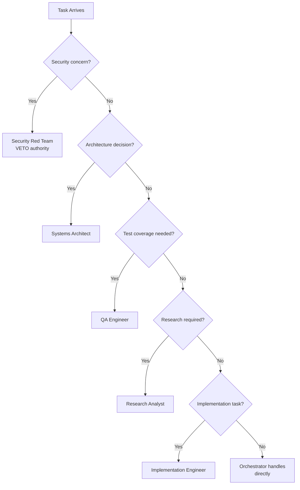

---

id: A02 extends: 06_AGENTS.md section: Worker Routing tags: \[agents, routing, orchestrator,
hierarchy] status: canonical priority: P1

## source: .github/WORKER_DECISION_TREE.md

# Amendment A02: Worker Decision Tree & Routing

## Purpose

Extends 06_AGENTS with detailed worker routing logic and hierarchical team structures.

## Decision Flow

When task arrives at Orchestrator:



## Routing Rules

| Condition            | Route To                | Authority Level      |
| -------------------- | ----------------------- | -------------------- |
| Auth bypass risk     | Security Red Team       | **VETO** (can block) |
| Data leakage         | Security Red Team       | **VETO**             |
| Type system design   | Systems Architect       | High                 |
| Multi-file changes   | Implementation Engineer | Medium               |
| Pattern verification | Research Analyst        | Medium               |
| Test generation      | QA Engineer             | Medium               |
| Single file edit     | Orchestrator (direct)   | Low                  |

## Hierarchical Team Structure

For complex tasks, spawn sub-teams:

```
ORCHESTRATOR (Commander)
│
├─ SEQUENCE 1: Analysis Team
│  └─ Research Analyst (discover scope)
│
├─ SEQUENCE 2: Implementation Teams (parallel)
│  ├─ Team A: Feature X
│  ├─ Team B: Feature Y
│  └─ Team C: Feature Z
│
└─ SEQUENCE 3: Validation Team
   ├─ QA Engineer (test)
   ├─ Security Red Team (audit)
   └─ Research Analyst (verify)
```

## Worker Contracts

Each worker must:

1. **Accept** task with clear acknowledgment
2. **Report** blockers immediately to Orchestrator
3. **Complete** assigned work before returning control
4. **Validate** output before marking complete

## Escalation Path

```
Worker → Team Lead → Orchestrator → Security Red Team (if needed)
```

## Reference

Full execution log: `archive/amendment-sources/WORKER_DECISION_TREE.md`
