```mermaid
graph TD
    A["Claim: Feature X works"] -->|requires| B{Dependency Y}
    B -->|verified ✓| C["Component Z"]
    B -->|unverified ✗| D["Service W"]
    C --> E["Confidence: 75%"]
    D --> E
    E -->|YELLOW| F["Needs verification"]

    style C fill:#ccffcc
    style D fill:#ffcccc
    style E fill:#ffffcc
```

```mermaid
graph TB
    subgraph Happy["✅ Happy Path (100%)"]
        HP1["Normal flow ✓"]
    end
    subgraph Errors["⚠️ Error Cases (40%)"]
        E1["✗ Timeout"]
        E2["✗ Network"]
        E3["✓ Invalid input"]
    end
    subgraph Integration["❌ Integration (0%)"]
        I1["✗ Real DB"]
        I2["✗ External API"]
    end
    subgraph Scale["❌ Scale (0%)"]
        S1["✗ Load test"]
    end

    Happy --> Coverage["Coverage: 35%<br/>🔴 GARBAGE"]
    Errors --> Coverage
    Integration --> Coverage
    Scale --> Coverage

    style Coverage fill:#ffcccc
    style Happy fill:#ccffcc
    style Errors fill:#ffffcc
    style Integration fill:#ffcccc
    style Scale fill:#ffcccc
```

```mermaid
graph TD
    Target["🎯 Target: Auth System"]
    Target --> A1["Attack: Token theft"]
    Target --> A2["Attack: Session fixation"]

    A1 --> M1["✓ Mitigated: HttpOnly"]
    A2 --> M2["✗ Vulnerable"]

    M2 --> R1["🔴 Fix before deploy"]

    style M1 fill:#ccffcc
    style M2 fill:#ffcccc
```

# Logic Agent CLI Reference

**Namespace**: `/logic` **Version**: 2.0.0 **Confidence Floor**: 85% (always-on, non-negotiable)

---

## Command Structure

```text
/logic <command> [flags] [#tag]
```

### Flags (Universal)

- `--help` (`-h`) — Show command help
- `--visual` (`-v`) — Generate Mermaid diagram
- `--fast` (`-f`) — Skip explanations, output only

### Tags

- `#shipping` — Deploy-related decision
- `#arch` — Architecture decision
- `#bug` — Bug investigation
- `#perf` — Performance related

---

## Confidence Floor (Always-On)

**Non-negotiable threshold** based on project CI gates:

```text
≥90% = 🟢 CLEAR     → Proceed (matches pattern validator threshold)
85-89% = 🟡 CAUTION → Proceed, document unknowns
70-84% = 🟠 YELLOW  → Needs verification (below PR gate)
<70% = 🔴 GARBAGE   → Cannot proceed, must verify more
```

**Evidence**: These thresholds align with project CI:

- Pattern validator requires ≥90
- PR merge gate: 70% coverage
- Main branch gate: 80% coverage
- See: `.github/workflows/ci.yml:470-474`

---

## Core Commands

### `/logic verify`

Full 5-step verification protocol.

```text
/logic verify                    # Full protocol
/logic verify -f                 # Fast mode (verdict only)
/logic verify -v                 # With dependency diagram
/logic verify #shipping          # Tag for deploy decision
```

**Output Format**:

```markdown
## Verification: [Subject]

### 1. CLAIM

[Statement being verified]

### 2. EVIDENCE NEEDED

- [ ] [Specific evidence A]
- [ ] [Specific evidence B]

### 3. EVIDENCE GATHERED

[Actual proof with file:line references]

### 4. ANALYSIS

[Does evidence support claim?]

### 5. VERDICT

**Confidence**: XX% [CLEAR|CAUTION|YELLOW|GARBAGE] **Proceed**: YES/NO **Risks**: [remaining
unknowns]
```

---

### `/logic chain`

Verify dependency chain (A→B→C all solid?).

```text
/logic chain                     # Verify current logic chain
/logic chain -v                  # With Mermaid diagram
```

**Text Output**:

```markdown
## Chain Analysis: [Subject]

| Link  | Status     | Evidence           |
| ----- | ---------- | ------------------ |
| A → B | ✓ verified | [file:line]        |
| B → C | ✗ assumed  | NEEDS VERIFICATION |

**Weakest link**: B → C (unverified) **Chain confidence**: 75% 🟠 YELLOW **Action**: Verify B → C
before proceeding
```

**Visual Output** (`-v`):



---

### `/logic risk`

Risk assessment matrix.

```text
/logic risk                      # Full risk assessment
/logic risk -v                   # With Mermaid severity grid
/logic risk #shipping            # Tag for deploy decision
```

**Text Output**:

```markdown
## Risk Assessment: [Subject]

### 🔴 CRITICAL (Block Deploy)

| Risk      | Probability | Impact | Mitigation   |
| --------- | ----------- | ------ | ------------ |
| Data loss | 10%         | 100%   | Add rollback |

### 🟠 HIGH (Mitigate First)

| Risk    | Probability | Impact | Mitigation      |
| ------- | ----------- | ------ | --------------- |
| Timeout | 40%         | 60%    | Circuit breaker |

### 🟡 MEDIUM (Acknowledge)

| Risk        | Probability | Impact | Mitigation  |
| ----------- | ----------- | ------ | ----------- |
| Stale cache | 30%         | 30%    | TTL + hooks |

### 🟢 LOW (Monitor)

| Risk      | Probability | Impact | Mitigation |
| --------- | ----------- | ------ | ---------- |
| Log noise | 80%         | 5%     | Log config |

**Risk Score**: 65/100 **Recommendation**: Address CRITICAL + HIGH before deploy
```

**Visual Output** (`-v`):


---

### `/logic test`

Test coverage analysis.

```text
/logic test                      # Coverage analysis
/logic test -v                   # With coverage diagram
```

**Text Output**:

```markdown
## Test Coverage: [Subject]

| Category    | Coverage | Status                       |
| ----------- | -------- | ---------------------------- |
| Happy path  | 100%     | ✅                           |
| Error cases | 40%      | ⚠️ Missing: timeout, network |
| Integration | 0%       | ❌ No service tests          |
| Scale/Load  | 0%       | ❌ No perf tests             |

**Overall**: 35% 🔴 GARBAGE **Missing Critical**:

- [ ] Timeout handling
- [ ] Network failure
- [ ] Database integration

**Verdict**: NOT safe to deploy
```

**Visual Output** (`-v`):



---

### `/logic assumptions`

Find hidden assumptions.

```text
/logic assumptions               # Extract all assumptions
/logic assumptions -f            # List only
```

**Output**:

```markdown
## Hidden Assumptions: [Subject]

### Verified ✓

| Assumption    | Evidence            |
| ------------- | ------------------- |
| API available | Health check passes |

### Unverified ⚠️

| Assumption | Risk               | Action         |
| ---------- | ------------------ | -------------- |
| Cache warm | Slow first request | Add warmup     |
| DB indexed | Query timeout      | Verify indexes |

### Dangerous 🔴

| Assumption        | Why Dangerous     |
| ----------------- | ----------------- |
| "Works locally"   | CI differs        |
| "User won't do X" | Users always do X |

**Count**: 12 total, 4 verified, 6 unverified, 2 dangerous **Impact**: 75% confidence (too many
unverified)
```

---

### `/logic red-team`

Attack the solution systematically.

```text
/logic red-team                  # Full attack analysis
/logic red-team -v               # With attack tree diagram
```

**Text Output**:

```markdown
## Red Team Analysis: [Subject]

### Attack Vectors

| Vector           | Exploitability | Impact | Status        |
| ---------------- | -------------- | ------ | ------------- |
| Token theft      | Medium         | High   | ✓ Mitigated   |
| Session fixation | Easy           | High   | 🔴 VULNERABLE |

### Vulnerabilities Found

1. **Session fixation** (CRITICAL)
   - No rotation on login
   - Fix: Regenerate session

### What Would Break This

- [ ] Network interception (HTTPS mitigates)
- [ ] XSS (CSP mitigates)

**Security confidence**: 70% 🟠 YELLOW
```

**Visual Output** (`-v`):



---

### `/logic confidence`

Rate certainty level with evidence breakdown.

```text
/logic confidence                # Rate current decision
```

**Output**:

```markdown
## Confidence Rating: [Subject]

### Rating Breakdown

| Factor        | Score | Evidence                 |
| ------------- | ----- | ------------------------ |
| Code verified | 95%   | TS strict, lint passing  |
| Tests passing | 90%   | Unit + integration green |
| Edge cases    | 60%   | Missing timeout tests    |
| Scale tested  | 0%    | No load testing          |

### Calculation

(95 + 90 + 60 + 0) / 4 = 61%

**Overall**: 61% 🔴 GARBAGE **Floor**: 85% (NOT MET) **Verdict**: Cannot proceed until scale testing
complete
```

---

### `/logic decision`

Document a decision with evidence.

```text
/logic decision                  # Document current decision
/logic decision #arch            # Tag as architecture decision
```

**Output**:

```markdown
## Decision Record: [Subject]

**Date**: [timestamp] **Tags**: #arch

### Context

[Why this decision is needed]

### Decision

[What was decided]

### Alternatives Considered

| Option   | Pros   | Cons    | Why Not      |
| -------- | ------ | ------- | ------------ |
| Option A | Fast   | Complex | Selected ✓   |
| Option B | Simple | Slow    | Perf concern |

### Evidence

- [Benchmark data]
- [Test results]

### Risks Accepted

- [ ] [Risk 1]
- [ ] [Risk 2]

**Confidence**: 88% 🟢 CLEAR
```

---

### `/logic ground`

Show evidence, not theory.

```text
/logic ground                    # Ground current claims
```

**Output**:

````markdown
## Ground Truth: [Subject]

### Claim

"API handles 1000 req/s"

### Theory (What We Think)

- Load balancer distributes evenly
- Database handles queries

### Reality (What We Know)

````bash
$ hey -n 1000 -c 100 https://api.example.com/health
Requests/sec: 810.37
```text

**Gap**: 810 actual vs 1000 claimed (81%)

### Grounded Statement

"API handles 810 req/s verified, not 1000 as claimed"

**Confidence**: 95% (based on test)
````
````

---

## Power Combos

### `/logic gauntlet` (Bulletproof Proposal)

Runs: `assumptions` → `verify` → `red-team`

```text

/logic gauntlet                  # Full gauntlet
/logic gauntlet -f               # Fast mode
/logic gauntlet #shipping        # For deploy decisions

```

**Output**: Combined report with go/no-go recommendation

---

### `/logic ladder` (Build Certainty)

Runs: `chain` → `confidence` → `ground`

```text

/logic ladder                    # Build confidence
/logic ladder -v                 # With visual progression

```

**Output**: Confidence ladder from claim to verified truth

---

### `/logic deploy` (Deploy Readiness)

Runs: `risk` → `test` → `decision`

```text

/logic deploy                    # Full deploy check
/logic deploy -v                 # With visual dashboard
/logic deploy #shipping          # Tag for audit

```

**Output**: Deploy readiness matrix with clear verdict

---

## Help System

### `/logic -h` or `/logic --help`

```text

Logic Agent - Radical Skepticism Protocol v2.0

USAGE: /logic <command> [flags] [#tag]

COMMANDS:
  verify          Full 5-step verification
  chain           Dependency chain check
  risk            Risk assessment matrix
  test            Coverage analysis
  assumptions     Find hidden assumptions
  red-team        Attack analysis
  confidence      Rate certainty
  decision        Document choice
  ground          Show evidence

COMBOS:
  gauntlet        assumptions → verify → red-team
  ladder          chain → confidence → ground
  deploy          risk → test → decision

FLAGS:
  -h, --help      Show this help
  -v, --visual    Generate Mermaid diagram
  -f, --fast      Skip explanations

TAGS:
  #shipping       Deploy decision
  #arch           Architecture
  #bug            Bug investigation
  #perf           Performance

CONFIDENCE FLOOR: 85% (always-on)
  ≥90% = CLEAR    → Proceed
  85-89% = CAUTION → Proceed with docs
  70-84% = YELLOW  → Needs verification
  <70% = GARBAGE   → Cannot proceed

EXAMPLES:
  /logic verify -v           Verify with diagram
  /logic risk #shipping      Risk for deploy
  /logic gauntlet -f         Fast bulletproof
  /logic deploy              Full deploy check

See: .github/instructions/logic-agent.instructions.md

```

---

## When to Auto-Invoke

Agent should **suggest** commands when:

- Major architecture decision → `/logic red-team`
- "I think..." / "probably..." → `/logic ground`
- Complex logic chain → `/logic chain -v`
- Before merging PR → `/logic deploy`
- After bug found → `/logic assumptions`
- Performance claim → `/logic verify`
- "Ready to ship" → `/logic gauntlet #shipping`

---

## Quick Reference Card

```text

COMMANDS:
/logic verify       Full 5-step verification
/logic chain        Dependency chain check
/logic risk         Risk assessment
/logic test         Coverage analysis
/logic assumptions  Hidden assumptions
/logic red-team     Attack analysis
/logic confidence   Certainty rating
/logic decision     Document choice
/logic ground       Evidence check

COMBOS:
/logic gauntlet     assume → verify → red-team
/logic ladder       chain → confidence → ground
/logic deploy       risk → test → decision

FLAGS:
-h  Help
-v  Visual (Mermaid)
-f  Fast mode

TAGS: #shipping #arch #bug #perf

FLOOR: 85% minimum confidence

```

---

**Version**: 2.0.0 **Last Updated**: December 28, 2025 **Hierarchy**: L2 (Instructions Layer) **See
Also**: [logic-agent.instructions.md](./logic-agent.instructions.md)
