# Fresh Schedules - Dependency Graph

## Overview

This document visualizes the dependency architecture of the Fresh Schedules monorepo.

## Layer-Based Dependency Graph


## Request Flow - Detailed

```mermaid
sequenceDiagram
    participant Client as Client
    participant Route as API Route
    participant SDK as SDK Factory
    participant Types as Type Validation
    participant Auth as Authentication
    participant Org as Organization Context
    participant Firestore as Firestore
    participant Rules as Security Rules

    Client->>Route: POST /api/shifts {data}
    activate Route
    
    Route->>SDK: createOrgEndpoint({input, config})
    activate SDK
    
    SDK->>Auth: Verify session cookie
    activate Auth
    Auth->>Auth: Check Firebase token
    Auth-->>SDK: ✅ Authenticated
    deactivate Auth
    
    SDK->>Org: Load organization context
    activate Org
    Org->>Firestore: Query memberships
    Firestore-->>Org: Return membership
    Org->>Org: Verify role >= 'manager'
    Org-->>SDK: ✅ Authorized
    deactivate Org
    
    SDK->>Types: Validate input with Zod
    activate Types
    Types->>Types: Parse & validate schema
    Types-->>SDK: ✅ Valid
    deactivate Types
    
    SDK-->>Route: ✅ All checks passed
    deactivate SDK
    
    Route->>Firestore: Write shift to /orgs/{orgId}/schedules/{id}/shifts
    activate Firestore
    
    Firestore->>Rules: Apply security rules
    activate Rules
    Rules->>Rules: isOrgMember(orgId)
    Rules->>Rules: hasAnyRole(['manager', 'admin', 'org_owner'])
    Rules-->>Firestore: ✅ Allow
    deactivate Rules
    
    Firestore->>Firestore: Create document
    Firestore-->>Route: ✅ Success
    deactivate Firestore
    
    Route->>Route: Format response (201 Created)
    Route-->>Client: {id, orgId, startTime, ...}
    deactivate Route
```



## Module Dependency Chain


## Triad of Trust - Entity Example (Shifts)

```mermaid
graph TB
    Entity["🎯 Shift Entity"]
    
    subgraph Schema["1️⃣ Schema"]
        ZodFile["packages/types/src/shifts.ts"]
        ZodCode["export const ShiftSchema = z.object({...})<br/>export type Shift = z.infer<typeof ShiftSchema>"]
    end
    
    subgraph API["2️⃣ API Route"]
        RouteFile["apps/web/app/api/shifts/route.ts"]
        RouteCode["import { CreateShiftSchema } from '@fresh-schedules/types'<br/>export const POST = createOrgEndpoint({<br/>  input: CreateShiftSchema,<br/>  handler: async ({ input, context }) => {...}"]
    end
    
    subgraph Rules["3️⃣ Security Rules"]
        RulesFile["firestore.rules"]
        RulesCode["match /orgs/{orgId}/schedules/{scheduleId}/shifts/{shiftId} {<br/>  allow write: if hasAnyRole(orgId, ['manager', 'admin', 'org_owner'])"]
    end
    
    Entity --> Schema
    Entity --> API
    Entity --> Rules
    
    Schema --> ZodFile
    ZodFile --> ZodCode
    
    API --> RouteFile
    RouteFile --> RouteCode
    
    Rules --> RulesFile
    RulesFile --> RulesCode
    
    ZodCode -.sync.-> RouteCode
    RouteCode -.sync.-> RulesCode
    
    style Entity fill:#ff9800
    style Schema fill:#f3e5f5
    style API fill:#fff3e0
    style Rules fill:#e8f5e9
```



## Package Interdependencies


## Key Dependency Chains

### 1. Type Safety Chain

```
User Input
    ↓
Zod Schema (types package)
    ↓
SDK Factory validation (api-framework)
    ↓
Handler execution
    ↓
TypeScript types ensure safety
```

### 2. Security Chain

```
HTTP Request
    ↓
Firebase Session Cookie
    ↓
Organization Membership Check
    ↓
Role-Based Authorization
    ↓
Rate Limiting
    ↓
Input Validation
    ↓
Handler Execution
    ↓
Firestore Security Rules
    ↓
Document-level access control
```

### 3. Data Flow Chain

```
API Route Handler
    ↓
getFirestore() from firebase-admin
    ↓
Query: /orgs/{orgId}/collections
    ↓
Firestore Evaluates Rules
    ↓
Document Returned (if authorized)
    ↓
Response to Client
```

## Circular Dependencies Check

✅ **No circular dependencies detected**

Key safeguards:

- `types/` package has no dependencies on other packages
- `api-framework/` only depends on `types/` (one-way)
- `apps/web/` depends on packages but not vice versa
- Clear layering prevents cycles

## Import Rules (Enforced)

✅ **Allowed**

- `apps/web` → `packages/*`
- `packages/api-framework` → `packages/types`
- `packages/ui` → `packages/config`
- Any package → External libraries (zod, firebase, react, etc.)

❌ **Prohibited**

- `packages/types` → Any other package (must be zero-dependency)
- `packages/*` → `apps/web` (circular!)
- Circular dependencies between any packages

## Monorepo Package.json Links

| Package | Purpose | Key Exports |
|---------|---------|------------|
| `packages/types` | Zod schemas | `ShiftSchema`, `CreateShiftSchema`, `Shift` type |
| `packages/api-framework` | SDK Factory | `createOrgEndpoint()`, `createAuthenticatedEndpoint()` |
| `packages/ui` | React components | `Button`, `Modal`, etc. |
| `packages/config` | Configuration | Environment variables, constants |
| `packages/rules-tests` | Test infrastructure | Firestore rules testing utilities |

## Repomix Analysis

To generate detailed dependency reports:

```bash
# Machine-readable JSON report
pnpm repomix . --style json --compress --output docs/dep-graph.json

# Human-readable Markdown report
pnpm repomix . --style markdown --output docs/dep-graph.md

# Full XML for integration
pnpm repomix . --style xml --output docs/dep-graph.xml
```

Reports include:

- Complete import/export chains
- File-level dependencies
- Module relationships
- Potential issues (circular deps, unused imports)
- Metrics (LOC, complexity)

## Architecture Principles

1. **Layered**: External → Shared → Application → Data
2. **Type-Safe**: Zod at boundaries for runtime validation
3. **Org-Scoped**: All data queries include organization context
4. **Synchronized**: Triad of Trust (Schema + API + Rules)
5. **Zero-Dependency Core**: `types/` has no package dependencies
6. **Single Responsibility**: Each package has one clear purpose

---

**Generated**: December 12, 2025  
**Tool**: Repomix  
**Status**: Production-Ready ✅
