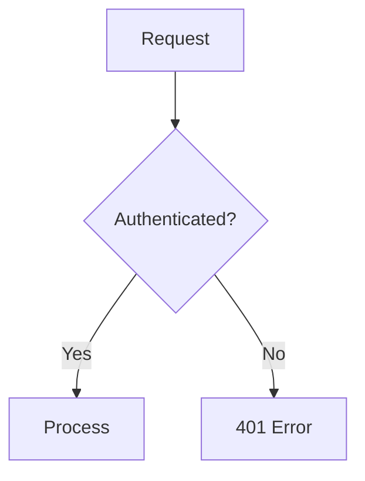

---

agent: "agent"
description: "Generate or update documentation (JSDoc, README, ADRs, API docs)"
tools:
\[
"edit",
"search",
"firecrawl/firecrawl-mcp-server/_",
"github/github-mcp-server/_",
"usages",
"problems",
"changes",
"testFailure",
"fetch",
"github.vscode-pull-request-github/copilotCodingAgent",
"github.vscode-pull-request-github/issue\_fetch",
"github.vscode-pull-request-github/suggest-fix",
"github.vscode-pull-request-github/searchSyntax",
"github.vscode-pull-request-github/doSearch",
"github.vscode-pull-request-github/renderIssues",
"github.vscode-pull-request-github/activePullRequest",
"github.vscode-pull-request-github/openPullRequest",
]
-

# Document
## Directive
Generate documentation for: `${input:Target}`

Target can be: file path, feature name, or "api" for API documentation.

## Purpose
This prompt generates comprehensive documentation that follows the Fresh Schedules documentation
standards, including JSDoc, README updates, architectural decision records, and user guides.

## Workflow
### Phase 1: Documentation Discovery
1. **Identify what needs documentation**
   - Analyze the file/module/feature specified
   - Check for existing documentation (inline, README, docs/)
   - Identify documentation gaps

1. **Determine documentation type**
   - **Code documentation**: JSDoc, inline comments
   - **API documentation**: Endpoint specs, request/response examples
   - **Architectural documentation**: ADRs, system diagrams
   - **User documentation**: README, guides, tutorials

### Phase 2: Documentation Generation
#### For Code (JSDoc)
```typescript
/**
 * Brief description of what the function does.
 *
 * @description Detailed explanation if the brief is insufficient.
 *
 * @param {Type} paramName - Description of the parameter
 * @returns {Type} Description of return value
 * @throws {ErrorType} When and why this error is thrown
 *
 * @example
 * // Example usage
 * const result = functionName(arg1, arg2);
 *
 * @see RelatedFunction
 * @since 1.0.0
 */
```

#### For APIs
Document each endpoint with:

- HTTP method and path
- Authentication requirements
- Request schema (with Zod reference)
- Response schema
- Error responses
- Rate limiting info
- Example requests/responses

#### For Architecture (ADR Format)
```markdown
# ADR-XXX: Title
## Status
Proposed | Accepted | Deprecated | Superseded by ADR-XXX

## Context
What is the issue we're seeing that motivates this decision?

## Decision
What is the change we're proposing/have decided?

## Consequences
What becomes easier or harder because of this change?
```

### Phase 3: Documentation Validation
- \[ ] All public APIs have JSDoc
- \[ ] README is current with actual behavior
- \[ ] Examples are tested and work
- \[ ] Links are valid
- \[ ] Terminology is consistent
- \[ ] Mermaid diagrams render correctly (if used)

## Documentation Standards
### Self-Explanatory Code Philosophy
- Prefer clear naming over comments
- Comment WHY, not WHAT
- Document non-obvious behavior
- Document edge cases and gotchas

### Required Documentation
| Element          | Required Doc                   |
| ---------------- | ------------------------------ |
| Public functions | JSDoc with @param, @returns    |
| API endpoints    | Request/response schemas       |
| Configuration    | All options documented         |
| Complex logic    | Inline comments explaining WHY |
| New features     | README section or guide        |

### Mermaid Diagrams
Use mermaid for:

- Flowcharts (workflows, decision trees)
- Sequence diagrams (API flows)
- Class diagrams (data models)
- State diagrams (entity lifecycle)

Example:



## Output Format
Generate documentation in the appropriate format:

- **JSDoc**: Add/update in source file
- **README**: Markdown with sections
- **API docs**: OpenAPI-style or Markdown tables
- **Guides**: Step-by-step Markdown

## Integration
This prompt integrates with:

- `/plan` - Plan documentation updates
- `/implement` - Document new implementations
- `/audit` - Security documentation review
