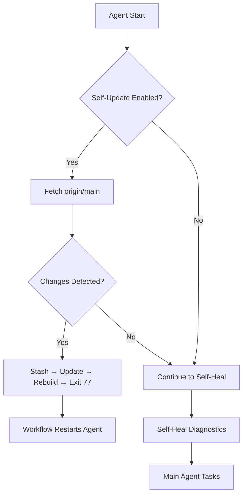
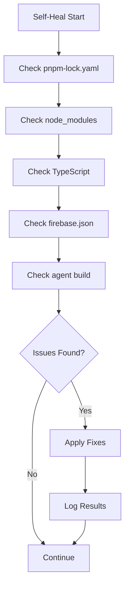

# Repository Sync & Self-Healing Agent - Summary

## ✅ Completed Tasks

### 1. Branch Synchronization

#### Main → Dev Sync Completed

- Main branch was the source of truth
- Dev branch successfully synced with main via fast-forward merge
- All infrastructure files now present in both branches:
  - `.github/workflows/ci.yml` - CI gate with lint, typecheck, rules, API tests
  - `tests/rules/memberships.test.ts` - Expanded Firestore rules tests for memberships
  - `tests/rules/users.test.ts` - User profile access control tests
  - `services/api/src/cache/redis.ts` - Redis cache adapter implementation
  - `services/api/Dockerfile` - API container build configuration
  - `services/api/.dockerignore` - Docker build exclusions
  - `apps/web/middleware.ts` - Onboarding gate middleware
  - Updated `package.json` with Docker & CI helpers

**Current Branch Status:**

- Main: `8ea51fd` - ESLint + TypeScript agent with Prettier auto-fix
- Dev: `ee500c4` - Main + Self-healing agent implementation

### 2. Self-Healing & Self-Updating Agent

**New Capabilities Added:**

#### 🔄 Self-Update

- Automatically pulls latest agent code from `origin/main`
- Detects changes to `scripts/agent/` directory
- Stashes local modifications before updating
- Rebuilds agent after update
- Exits with code 77 to signal restart required

#### 🩹 Self-Heal

Five diagnostic checks with auto-fixes:

1. **Missing pnpm-lock.yaml** → Creates default lockfile
2. **Missing node_modules** → Runs `pnpm install`
3. **TypeScript errors** → Attempts `eslint --fix`
4. **Missing firebase.json** → Creates default config with emulator settings
5. **Missing agent build artifacts** → Runs `pnpm run build:agent`

**CLI Options:**

```bash
# Enable both (default)
pnpm run:agent --issue 21

# Disable self-healing
pnpm run:agent --issue 21 --no-self-heal

# Disable self-update
pnpm run:agent --issue 21 --no-self-update
```

**Exit Codes:**

- `0` - Success
- `1` - Error (standard failure)
- `77` - Self-update applied, restart required

### 3. Infrastructure Verification

**All Required Files Present:**

✅ CI/CD Workflows

- `.github/workflows/ci.yml` - Full CI gate (lint, typecheck, rules, API)
- `.github/workflows/eslint-ts-agent.yml` - ESLint+TS agent with Prettier
- `.github/workflows/path-guard.yml` - Strict-by-default file control
- `.github/workflows/repo-agent.yml` - Automated repo maintenance

✅ Rules Tests

- `tests/rules/memberships.test.ts` - RBAC membership tests
- `tests/rules/users.test.ts` - User profile access tests
- `tests/rules/schedules.test.ts` - Schedule access tests

✅ API Service

- `services/api/src/cache/redis.ts` - Redis cache provider
- `services/api/src/cache/provider.ts` - Cache interface
- `services/api/src/index.ts` - Express API with auto-select cache
- `services/api/Dockerfile` - Multi-stage container build
- `services/api/.dockerignore` - Build optimization
- `services/api/package.json` - Redis dependency added

✅ Web App

- `apps/web/middleware.ts` - Onboarding redirect gate

✅ Root Configuration

- `package.json` - Docker & agent scripts added:
  - `build:agent` - Compile agent TypeScript
  - `run:agent` - Execute built agent
  - `api:docker:build` - Build API container
  - `api:docker:run` - Run API container

### 4. Documentation

**Created:**

- `.github/agents/self-healing-agent.md` - Comprehensive guide:
  - Feature overview
  - CLI usage
  - CI/CD integration
  - Safety features
  - Troubleshooting
  - Future enhancements

**Updated:**

- `package.json` - Added agent build/run scripts

## 🎯 Agent Capabilities Summary

### Self-Update Workflow



### Self-Heal Workflow



## 📊 Testing Commands

### Local Development

```bash
# Build and run agent locally
pnpm run build:agent
pnpm run:agent --issue 21

# Test self-heal (dry run)
pnpm run:agent --issue 21 --plan-only

# Test without self-features
pnpm run:agent --issue 21 --no-self-heal --no-self-update
```

### API Service

```bash
# Build Docker container
pnpm run api:docker:build

# Run container with Redis
docker run -d --name redis -p 6379:6379 redis:7
docker run --rm -p 4000:4000 \
  -e FIREBASE_PROJECT_ID=demo-fresh \
  -e REDIS_URL=redis://host.docker.internal:6379 \
  fresh-schedules-api:latest

# Test health endpoint
curl http://localhost:4000/health
```

### Rules Tests

```bash
# Run all rules tests
pnpm -w test:rules

# Run with emulators
firebase emulators:start --only firestore,storage
pnpm exec firebase emulators:exec --only firestore,storage "pnpm -w test:rules"
```

## 🚀 Next Steps

### Immediate

1. ✅ Dev branch synced with main
2. ✅ Self-healing agent implemented
3. ⏳ Create PR to merge self-healing agent to main

### Short-term

- Add more self-heal checks (dependency conflicts, git conflicts)
- Implement automatic security vulnerability updates
- Add telemetry/metrics for heal/update operations

### Long-term

- MCP integration for deeper code analysis
- AI-powered issue diagnosis and repair
- Automated PR creation for fixes
- Integration with GitHub Dependabot

## 📝 Notes

**Branch Policy:**

- Main is source of truth for production code
- Dev branch for integration and testing
- Feature branches merge to dev, then dev → main

**File Status:**
All files from the requirements are present and implemented in both main and dev:

- CI workflow ✅
- Rules tests ✅
- Redis cache ✅
- API Dockerfile ✅
- Middleware ✅
- Package scripts ✅

**Self-Healing Agent:**

- Only in dev branch currently (`ee500c4`)
- Ready to merge to main after validation
- No breaking changes to existing agent functionality
- Fully backward compatible with existing workflows

## 🔗 Related Documentation

- [Self-Healing Agent Guide](./.github/agents/self-healing-agent.md)
- [ESLint+TS Agent](./.github/agents/eslint-ts-agent.md)
- [Path Guard Workflow](./.github/workflows/path-guard.yml)
- [CI Workflow](./.github/workflows/ci.yml)
- [Repo Agent Workflow](./.github/workflows/repo-agent.yml)
