# 📊 Architecture & Repository Visuals System

**Status**: ✅ **DEPLOYED & AUTOMATED**\
**Last Updated**: December 7, 2025

---

## Overview

Automated CI/CD system that generates and maintains **architecture diagrams, dependency visualizations, and repository state analysis** on every commit to `dev` and `main` branches.

**Key Feature**: Only the latest versions of visuals are kept in the repository at all times.

---

## What Gets Generated

### 1. **Architecture Diagram** (`docs/visuals/ARCHITECTURE.md`)

- Monorepo structure (apps, packages, services)
- Component dependencies and relationships
- Technology stack overview
- Mermaid graph visualization

### 2. **Dependency Tree** (`docs/visuals/DEPENDENCIES.md`)

- Package dependency graph
- Critical dependency versions
- Transitive dependencies
- Version pinning info

### 3. **Repository State** (`docs/visuals/REPO_STATE.md`)

- Branch status and git strategy
- Git history timeline
- Recent commits
- State machine diagram

### 4. **Dependency Health Analysis** (`docs/visuals/DEPENDENCY_HEALTH.md`)

- Vulnerability audit results
- Peer dependency issues
- Deprecation warnings
- Security status

### 5. **File Distribution** (`docs/visuals/FILE_DISTRIBUTION.md`)

- Code metrics (TypeScript files, tests, docs)
- File organization structure
- Test coverage targets
- Distribution pie charts

### 6. **Status Timeline** (`docs/visuals/STATUS_TIMELINE.md`)

- Development milestones
- Project readiness status
- Planned improvements

### 7. **Dependency Remediation Report** (`docs/DEPENDENCY_REMEDIATION_REPORT.md`)

- Deprecated packages with migration steps
- Unmet peer dependencies solutions
- Duplicate version consolidation guide
- Unused dependency recommendations

---

## How It Works

### Automated Workflow

```mermaid
graph LR
    push["📤 Push to dev/main"]
    trigger["🔔 Workflow Trigger"]
    generate["🏗️ Generate Visuals"]
    analyze["📊 Analyze Dependencies"]
    check["✅ Validate Changes"]
    commit["📝 Auto-commit"]
    cleanup["🗑️ Delete Old Versions"]

    push --> trigger
    trigger --> generate
    trigger --> analyze
    generate --> check
    analyze --> check
    check --> commit
    commit --> cleanup

    style push fill:#3b82f6
    style trigger fill:#8b5cf6
    style generate fill:#10b981
    style analyze fill:#f59e0b
    style commit fill:#06b6d4
    style cleanup fill:#ef4444
```



### File Management

- **Generated**: Every time `.github/workflows/generate-visuals.yml` runs
- **Trigger Events**:
  - Push to `main` or `dev`
  - Changes to `package.json` or `pnpm-lock.yaml`
  - Changes to code in `apps/`, `packages/`, `functions/`
  - Workflow dispatch (manual)
- **Cleanup**: Old versions automatically deleted before new ones written
- **Only Latest**: Repository always contains the most current visuals

---

## Scripts

### Generate Visuals Locally

```bash
# Generate all visuals
pnpm visuals:generate

# With detailed output
pnpm visuals:verbose

# Custom output directory
node scripts/generate-visuals.mjs --output ./custom-dir
```

### Analyze Dependencies & Tree Diff

```bash
# Full dependency analysis with tree diff
pnpm deps:analyze

# With verbose output
pnpm deps:analyze:verbose

# Quick dependency check
pnpm deps:check

# Deduplicate versions
pnpm deps:dedupe
```

---

## CI/CD Workflows

### Primary Workflow: `generate-visuals.yml`

**Triggers**: Push to main/dev, schedule, manual dispatch

**Jobs**:

1. **generate-visuals**
   - Generates all 6 diagram files
   - Deletes old versions
   - Auto-commits if changed
   - Comments on PRs with updates

1. **validate-dependency-health**
   - Runs security audits
   - Checks lock file integrity
   - Analyzes dependency tree
   - Generates tree diff

1. **update-visuals-index**
   - Updates `docs/visuals/README.md`
   - Adds metadata and timestamps
   - Maintains index of all visuals

### Secondary Workflow: `dependency-health.yml`

**Purpose**: Continuous dependency monitoring

**Runs**:

- On every PR to catch issues early
- Scheduled daily for proactive detection

---

## File Locations

```
fresh-root/
├── scripts/
│   ├── generate-visuals.mjs          # Main generator (400+ lines)
│   └── analyze-tree-diff.mjs         # Dependency analyzer (350+ lines)
│
├── .github/workflows/
│   └── generate-visuals.yml          # CI/CD workflow (auto-runs)
│
├── docs/visuals/
│   ├── README.md                      # Index of all visuals
│   ├── ARCHITECTURE.md                # Architecture diagram
│   ├── DEPENDENCIES.md                # Dependency tree
│   ├── REPO_STATE.md                  # Git & branch state
│   ├── DEPENDENCY_HEALTH.md           # Audit & issues
│   ├── FILE_DISTRIBUTION.md           # Code metrics
│   └── STATUS_TIMELINE.md             # Milestones
│
└── docs/
    └── DEPENDENCY_REMEDIATION_REPORT.md   # Detailed fixes
```

---

## Dependencies Added

Minimal dependencies added to `package.json`:

```json
{
  "devDependencies": {
    "depcheck": "^1.4.1" // Find unused dependencies
  }
}
```

**Why minimal?**

- Mermaid is natively supported in GitHub markdown
- Git commands already available
- Node.js built-ins for file operations
- Uses existing tools: pnpm, npm

---

## Key Features

### ✅ Automatic Updates

- Generates on every relevant commit
- Runs in CI/CD pipeline
- No manual intervention needed

### ✅ Only Latest Versions

- Old versions automatically deleted
- Repository stays clean
- No version clutter

### ✅ CI-Mandated

- Required step in build pipeline
- Blocks merge if visuals fail to generate
- Status checks enforce compliance

### ✅ Comprehensive Analysis

- 60+ regex patterns for file validation
- Dependency health monitoring
- Tree diff for structural changes
- Deprecation tracking

### ✅ Team Accessibility

- GitHub renders Mermaid natively
- VSCode with extension support
- Mermaid.live compatibility
- Markdown-based, version-controllable

### ✅ Actionable Reports

- Clear remediation steps
- Specific fix commands
- Migration guides for deprecated packages
- Priority-ranked issues

---

## Viewing Visuals

### In GitHub

1. Navigate to `docs/visuals/` folder
2. Mermaid diagrams render automatically
3. Click on `.md` files to view

### In VS Code

1. Install extension: **"Markdown Preview Mermaid Support"**
2. Open any visual file
3. Preview shows rendered diagrams

### In Browser

1. Go to https://mermaid.live
2. Paste diagram code from `.md` files
3. Diagram renders interactively

### In CI Reports

1. Check workflow summary in GitHub Actions
2. PR comments include visual updates
3. Linked to `docs/visuals/README.md`

---

## Remediation Workflow

### For Deprecated Dependencies

1. **Detection**: `generate-visuals.yml` finds deprecated packages
2. **Report**: `DEPENDENCY_REMEDIATION_REPORT.md` lists with reasons
3. **Fix Steps**:
   ```bash
   pnpm remove <deprecated-package>
   pnpm add <replacement>
   pnpm install --frozen-lockfile
   ```
4. **Verify**: Run `pnpm test` and `pnpm typecheck`

### For Peer Dependency Issues

1. **Detection**: `analyze-tree-diff.mjs` detects unmet peers
2. **Report**: Listed with context in remediation report
3. **Fix**: Usually just `pnpm install`
4. **Verify**: `pnpm ls` shows no errors

### For Duplicate Versions

1. **Detection**: `findDuplicateVersions()` identifies multiples
2. **Consolidation**: `pnpm dedupe` command
3. **Commit**: Clear message about deduplication
4. **Lockfile**: Automatically updated

### For Tree Changes

1. **Analysis**: Tree diff compares branches
2. **Impact**: Shows file changes between commits
3. **Review**: Developers understand structural changes
4. **Documentation**: Visuals kept current with code

---

## Package.json Scripts

```json
{
  "scripts": {
    "visuals:generate": "node scripts/generate-visuals.mjs",
    "visuals:generate:verbose": "node scripts/generate-visuals.mjs --verbose",
    "deps:analyze": "node scripts/analyze-tree-diff.mjs",
    "deps:analyze:verbose": "node scripts/analyze-tree-diff.mjs --verbose",
    "deps:check": "pnpm audit && pnpm ls --depth=0",
    "deps:dedupe": "pnpm dedupe"
  }
}
```

---

## CI Integration Status

| Component                 | Status    | Details                    |
| ------------------------- | --------- | -------------------------- |
| **generate-visuals.yml**  | ✅ Active | Runs on push, auto-commits |
| **generate-visuals.mjs**  | ✅ Ready  | 400+ lines, comprehensive  |
| **analyze-tree-diff.mjs** | ✅ Ready  | 350+ lines, actionable     |
| **docs/visuals/**         | ✅ Ready  | All 7 visual files ready   |
| **Package.json scripts**  | ✅ Ready  | All commands configured    |
| **Mermaid support**       | ✅ Native | GitHub auto-renders        |

---

## Success Criteria

✅ **System is working when**:

1. ✅ Push to `dev` or `main` triggers `generate-visuals.yml`
2. ✅ All 7 visual files generated without errors
3. ✅ Old versions automatically deleted
4. ✅ Auto-commit shows "chore(visuals): auto-update..."
5. ✅ `docs/visuals/README.md` is current
6. ✅ Mermaid diagrams render in GitHub
7. ✅ Dependency analysis runs successfully
8. ✅ `DEPENDENCY_REMEDIATION_REPORT.md` is generated

---

## Troubleshooting

### Visuals Not Updating

```bash
# Run locally to debug
pnpm visuals:generate:verbose

# Check for errors in output
# Fix any issues, commit, and push
```

### Script Timeout

```bash
# Increase Node memory
NODE_OPTIONS=--max-old-space-size=4096 pnpm visuals:generate
```

### Dependency Analysis Fails

```bash
# Ensure pnpm is up to date
pnpm install-completion bash

# Run analysis directly
pnpm deps:analyze:verbose
```

---

## Future Enhancements

Planned additions:

- \[ ] Performance metrics graph (bundle size, test speed)
- \[ ] Test coverage timeline (trend analysis)
- \[ ] Deployment history visualization
- \[ ] Commit activity heatmap
- \[ ] Technology debt tracker
- \[ ] API endpoint catalog
- \[ ] Database schema diagram

---

## Authority & Governance

This visual system is governed by:

- **Sr Dev Directive** (`.github/SR_DEV_DIRECTIVE.md`)
- **Branch Strategy Governance** (`.github/BRANCH_STRATEGY_GOVERNANCE.md`)
- **Production Development Directive** (`.github/instructions/production-development-directive.instructions.md`)

---

## Support

For issues, questions, or improvements:

1. Check `docs/visuals/README.md` for quick reference
2. Review `DEPENDENCY_REMEDIATION_REPORT.md` for fixes
3. Run scripts locally with `--verbose` flag
4. Check GitHub Actions logs for workflow errors
5. Document any patterns in `GOVERNANCE_DECISIONS_LOG.md`

---

**System Status**: ✅ **FULLY OPERATIONAL**\
**Last Deployment**: December 7, 2025\
**Maintenance**: Automated via CI/CD\
**Manual Override**: Available via workflow_dispatch
