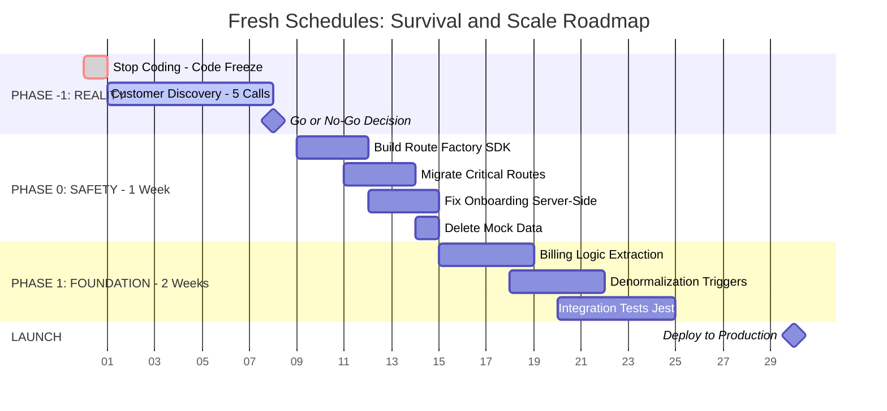
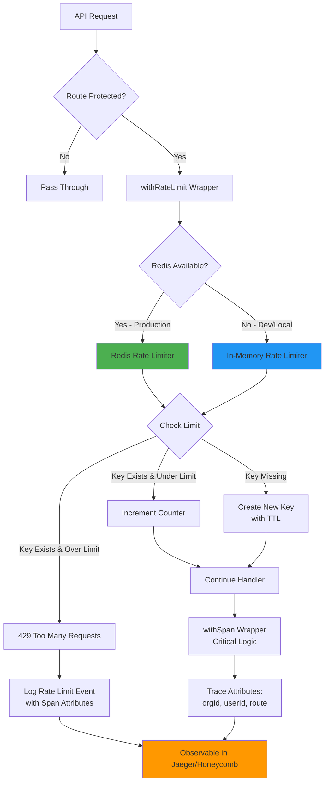
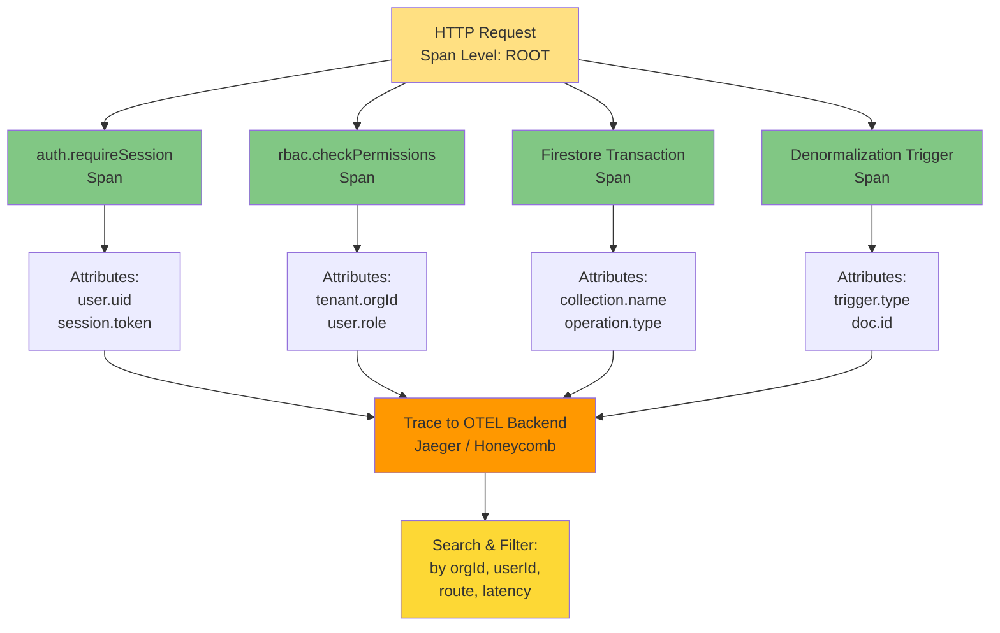

# Architecture Diagrams

Strategic visual representations of Fresh Schedules infrastructure, execution roadmap, and critical flows.

---

## 1. Strategic Execution Roadmap (Gantt)

**Timeline:** Phase -1 (Reality) → Phase 0 (Safety) → Phase 1 (Foundation) → Launch



---

## 2. Rate Limiting & Rate Limit Observability Architecture (Flowchart)

**System:** Dual-mode rate limiter with Redis (production) and in-memory fallback (dev)



---

## 3. OpenTelemetry Tracing Hierarchy (Layered Spans)

**Observability:** Request span → Critical inner spans with attributes



---

## 4. Production Validation & Environment Configuration (Sequence)

**Flow:** Build → Runtime → Validation → Operational Guarantee

```mermaid
sequenceDiagram
    participant Build as Build Phase
    participant Runtime as Runtime Init
    participant Env as Env Schema<br/>Zod Validation
    participant App as App Handler
    participant Prod as Production Check

    Build ->> Build: NEXT_PHASE=build<br/>(optional fields)
    Build -->> Runtime: Skip strict validation

    Runtime ->> Env: Load process.env
    Env ->> Env: Parse required fields:<br/>FIREBASE_PROJECT_ID

    Env ->> Runtime: Optional fields OK?<br/>REDIS_URL<br/>OTEL_EXPORTER_OTLP_ENDPOINT

    Runtime -->> App: ✅ Env validated<br/>Features gated

    App ->> Prod: Route handler fires
    Prod ->> Prod: assertProduction()?<br/>NODE_ENV=production

    alt Redis Available
        Prod ->> Prod: Use Redis rate limiter
    else Redis Missing
        Prod ->> Prod: Fallback to in-memory<br/>(single-instance only)
    end

    alt OTEL Endpoint Available
        Prod ->> Prod: Initialize OTEL SDK<br/>lazy-loaded
    else OTEL Missing
        Prod ->> Prod: Tracing no-ops<br/>but code continues
    end

    Prod -->> App: ✅ Production<br/>operational guarantee

    style Build fill:#90CAF9
    style Runtime fill:#81C784
    style Env fill:#FFB74D
    style Prod fill:#FF9800
```

---

## Key Takeaways

| Diagram                    | Purpose                                                | Usage                                               |
| -------------------------- | ------------------------------------------------------ | --------------------------------------------------- |
| **1. Gantt**               | Strategic timeline for phases and milestones           | Project planning, stakeholder alignment             |
| **2. Rate Limit Flow**     | How dual-mode rate limiting works with observability   | Engineering onboarding, debugging rate limit issues |
| **3. OTEL Spans**          | Hierarchical tracing and attribute collection          | Observability standard compliance, trace design     |
| **4. Validation Sequence** | Environment config lifecycle and production guarantees | Infrastructure validation, deployment checklist     |

---

## References

- **Rate Limiting:** `apps/web/src/lib/api/rate-limit.ts`
- **OTEL Initialization:** `apps/web/app/api/_shared/otel-init.ts`
- **Environment Validation:** `packages/env/src/index.ts`
- **Tracing Helpers:** `apps/web/app/api/_shared/otel.ts`
- **Observability Standard:** `docs/standards/OBSERVABILITY_AND_TRACING_STANDARD.md`
