# Agent System Architecture

Visual documentation of the AI agent instruction system, workflow handoffs, and quality gates.

---

## 1. Instruction Hierarchy Mind Map


---

## 2. Red Team Handoff Workflow


---

## 3. Quality Gate Flow

```mermaid
flowchart LR
    subgraph Gates["Quality Gates (Ordered)"]
        direction TB
        G1[/"🔴 TIER 0: Security<br/>-25 pts each<br/>BLOCKS PR"/]
        G2[/"🟠 TIER 1: Integrity<br/>-10 pts each<br/>BLOCKS PR"/]
        G3[/"🟡 TIER 2: Architecture<br/>-2 pts each<br/>WARNING"/]
        G4[/"🟢 TIER 3: Style<br/>-0.5 pts each<br/>INFO"/]
    end

    subgraph Checks["Validation Checks"]
        C1[TypeScript Strict]
        C2[ESLint + Prettier]
        C3[Pattern Validator ≥90]
        C4[Unit Tests Pass]
        C5[Security Wrapper Present]
        C6[Zod Validation]
    end

    subgraph CI["CI Pipeline"]
        CI1[pnpm install]
        CI2[pnpm typecheck]
        CI3[pnpm lint]
        CI4[pnpm test]
        CI5[pnpm build]
        CI1 --> CI2 --> CI3 --> CI4 --> CI5
    end

    G1 --> C5 & C6
    G2 --> C1 & C4
    G3 --> C2 & C3
    G4 --> C3

    C1 & C2 & C3 & C4 --> CI

    style G1 fill:#ff6666,stroke:#cc0000,color:#fff
    style G2 fill:#ffaa66,stroke:#cc6600,color:#000
    style G3 fill:#ffff66,stroke:#cccc00,color:#000
    style G4 fill:#66ff66,stroke:#00cc00,color:#000
```



---

## 4. Instruction Loading Strategy


---

## 5. CrewOps Swarm Protocol

```mermaid
flowchart TB
    subgraph Orchestrator["🎯 Orchestrator (Primary)"]
        O1[Route Tasks]
        O2[Arbitrate Conflicts]
        O3[Synthesize Results]
    end

    subgraph Workers["👥 Specialized Workers"]
        W1[📊 Research Analyst<br/>read_file, grep_search<br/>semantic_search, MCP]
        W2[🏗️ Systems Architect<br/>Design, Interfaces<br/>Pattern Compliance]
        W3[🔴 Security Red Team<br/>Threat Model<br/>VETO POWER]
        W4[✅ QA Engineer<br/>get_errors, tests<br/>GREEN GATES]
        W5[📝 Scribe<br/>Documentation<br/>Audit Trail]
    end

    subgraph Phases["📋 Execution Phases"]
        P1[Phase A: Context]
        P2[Phase B: Plan]
        P3[Phase C: Team]
        P4[Phase D: Execute]
        P5[Phase E: Validate]
    end

    O1 --> W1 & W2 & W3 & W4 & W5
    W1 --> P1
    W2 --> P2
    O1 --> P3
    W1 & W2 & W4 --> P4
    W3 & W4 --> P5
    P5 --> O2 --> O3

    style W3 fill:#ffcccc,stroke:#cc0000
    style W4 fill:#ccffcc,stroke:#00cc00
```



---

## 6. Slash Command Ecosystem

```mermaid
flowchart LR
    subgraph Commands["Slash Commands"]
        C1[/plan]
        C2[/implement]
        C3[/review]
        C4[/audit]
        C5[/red-team]
        C6[/document]
        C7[/test]
        C8[/deploy]
    end

    subgraph Workflows["Triggered Workflows"]
        W1[Create TODO List<br/>Design Architecture<br/>Map Dependencies]
        W2[Execute Plan<br/>Write Code<br/>Validate Changes]
        W3[Code Review<br/>Pattern Check<br/>Best Practices]
        W4[Security Audit<br/>OWASP Check<br/>Vulnerability Scan]
        W5[Red Team Attack<br/>Sr Dev Vetting<br/>Final Approval]
        W6[Diátaxis Framework<br/>API Docs<br/>README Updates]
        W7[Unit Tests<br/>E2E Tests<br/>Coverage Report]
        W8[Build<br/>Validate<br/>Push to Prod]
    end

    subgraph Instructions["Loaded Instructions"]
        I1[01_MASTER]
        I2[02_CODE_QUALITY]
        I3[03_SECURITY]
        I4[04_FRAMEWORK]
        I5[05_TESTING]
    end

    C1 --> W1 --> I1
    C2 --> W2 --> I1 & I2 & I4
    C3 --> W3 --> I1 & I2 & I5
    C4 --> W4 --> I1 & I3
    C5 --> W5 --> I1 & I3 & I5
    C6 --> W6 --> I1
    C7 --> W7 --> I1 & I5
    C8 --> W8 --> I1 & I4
```

---

## 7. Error Pattern Detection & Safeguard Creation


---

## 8. Complete Agent System Architecture


---

## Diagram Legend

| Symbol | Meaning |
|--------|---------|
| 🔴 Red Fill | Security/Critical (Blocking) |
| 🟠 Orange Fill | Integrity (Blocking) |
| 🟡 Yellow Fill | Warning (Non-Blocking) |
| 🟢 Green Fill | Success/Validation |
| 🔵 Blue Fill | Core/Always Loaded |
| Dashed Line | Dependency/Reference |
| Solid Line | Direct Flow |

---

**Last Updated**: December 8, 2025  
**Rendering**: GitHub, VS Code (Markdown Preview Mermaid Support), mermaid.live
