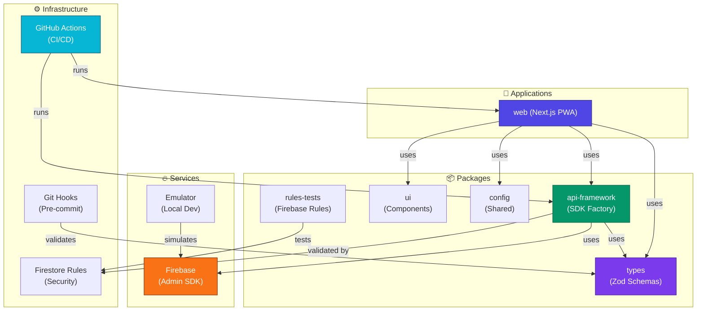

# Architecture Diagram

## Architecture Principles
- **Monorepo**: pnpm workspaces + Turbo
- **Type Safety**: Zod-first validation, TypeScript strict
- **SDK Factory**: Declarative API route pattern (90%+ coverage)
- **Organization Isolation**: All queries scoped to orgId
- **Security**: Multi-layer (rules, auth, RBAC, validation)
- **Testing**: Unit + Integration + E2E
