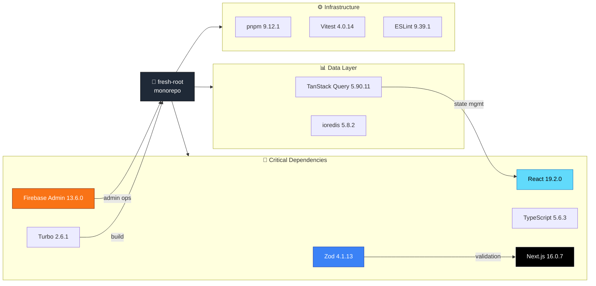

# Dependency Tree

```mermaid
graph LR
    root["🌳 fresh-root<br/>monorepo"]

    subgraph core["🔴 Critical Dependencies"]
        react["React 19.2.0"]
        ts["TypeScript 5.6.3"]
        zod["Zod 4.1.13"]
        firebase["Firebase Admin 13.6.0"]
        next["Next.js 16.0.7"]
        turbo["Turbo 2.6.1"]
    end

    subgraph data["📊 Data Layer"]
        query["TanStack Query 5.90.11"]
        ioredis["ioredis 5.8.2"]
    end

    subgraph infra["⚙️ Infrastructure"]
        pnpm["pnpm 9.12.1"]
        vitest["Vitest 4.0.14"]
        eslint["ESLint 9.39.1"]
    end

    root --> core
    root --> data
    root --> infra

    zod -->|validation| next
    firebase -->|admin ops| root
    query -->|state mgmt| react
    turbo -->|build| root

    style root fill:#1f2937,stroke:#111,color:#fff
    style react fill:#61dafb,stroke:#1c77c3,color:#000
    style next fill:#000,stroke:#fff,color:#fff
    style zod fill:#3b82f6,stroke:#1e40af,color:#fff
    style firebase fill:#f97316,stroke:#7c2d12,color:#fff
```

## Top Dependencies
