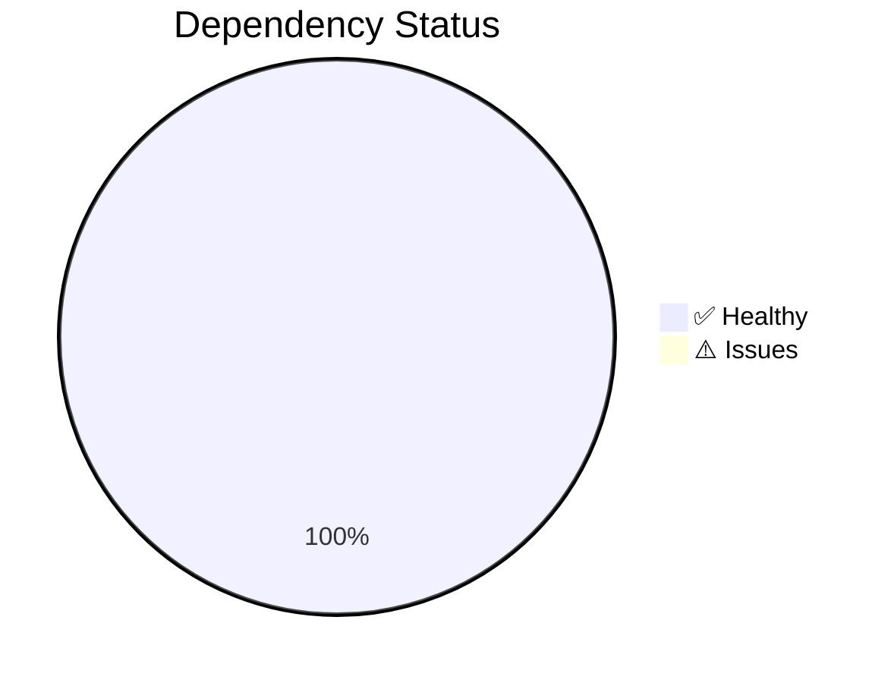

---

title: "Dependency Health Analysis"
description: "Visual analysis of dependency health and vulnerability status"
keywords:
  - dependencies
  - health
  - analysis
  - vulnerabilities
  - visual
category: "report"
status: "active"
audience:
  - developers
  - operators
related-docs:
  - ../architecture/DEPENDENCY\_GRAPH.md
  - DEPENDENCIES.md
createdAt: "2026-01-31T07:19:03Z"
lastUpdated: "2026-01-31T07:19:03Z"

---

# Dependency Health Analysis



## Security Status

- **Vulnerabilities Found**: 0
- **Status**: ✅ CLEAN

## Common Issues & Fixes

### Deprecated Packages

```bash
# Check for deprecated packages
pnpm audit --deprecated

# Update to latest
pnpm update --latest

# Clean lockfile
pnpm install --frozen-lockfile
```

### Unmet Peer Dependencies

```bash
# View peer dependency issues
pnpm ls --depth 0

# Fix peer dependencies
pnpm install
```

### Tree Diff (Monorepo Changes)

```bash
# See what changed
git diff --name-only HEAD~1

# Visualize structure
pnpm list --depth=1
```

## Recommendations

1. Run `pnpm audit fix` to auto-fix vulnerabilities
2. Review lockfile diffs before committing
3. Run `pnpm install --frozen-lockfile` in CI
4. Use `pnpm update --interactive` for controlled upgrades
