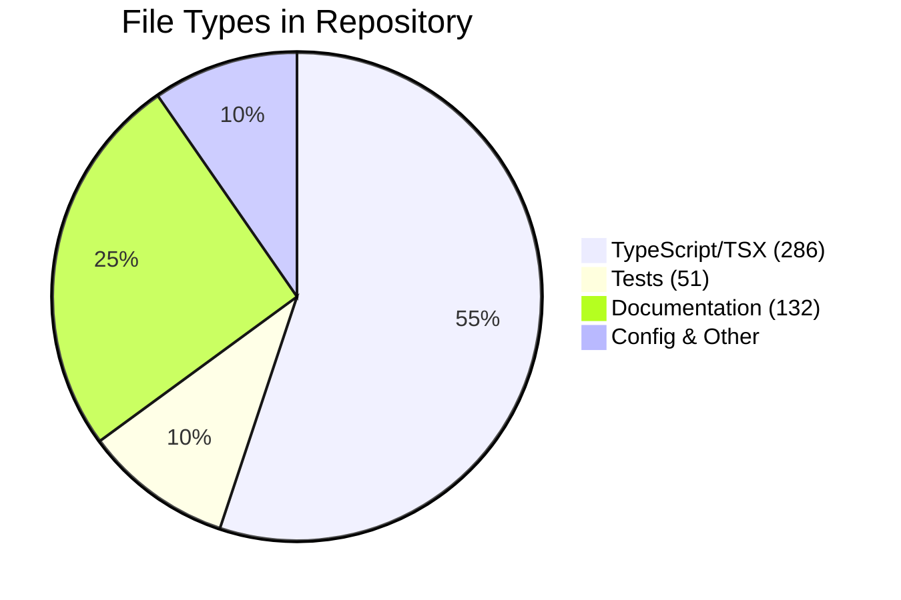

# File Distribution



## Codebase Metrics
- **TypeScript Files**: 286
- **Test Files**: 51
- **Documentation**: 132 files
- **Test Coverage**: Target 80%+

## File Organization
```
apps/
  web/
    app/              # Next.js App Router
    src/lib/          # Client utilities
    src/components/   # React components

packages/
  api-framework/     # SDK Factory pattern
  types/             # Zod schemas
  ui/                # Component library
  config/            # Shared configs

functions/           # Cloud Functions
tests/               # Integration & E2E tests
docs/                # Documentation
```
