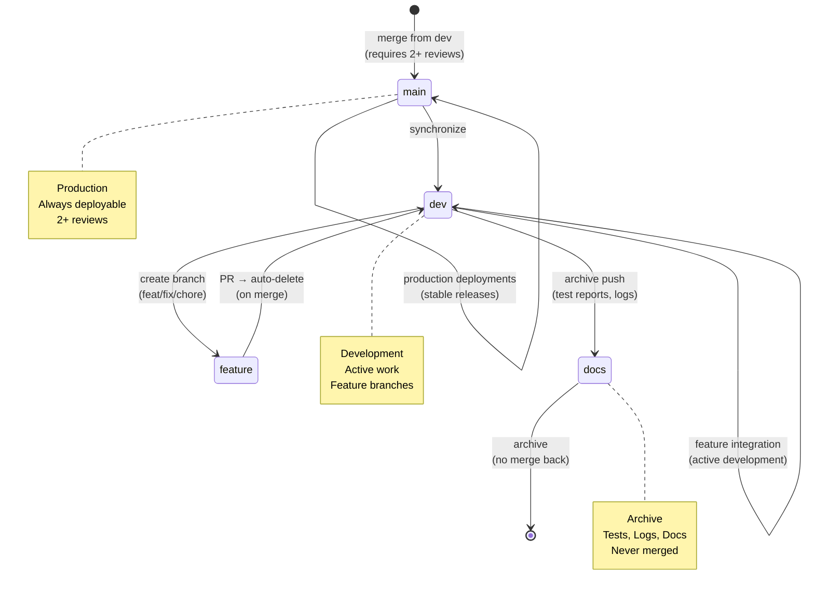

# Repository State



## Current State
- **Branch**: `main`
- **Total Branches**: 10
- **Uncommitted Changes**: 9

## Recent Commits
```
9bc7ca6 feat(governance): distribute branch strategy rules to main branch
a72924a feat(testintel): add E2E test generation, documentation, and npm publishing
856da34 Merge pull request #112 from peteywee/test/intelligence
cc02dd9 Add files via upload
abf82cd Merge pull request #111 from peteywee/dev
7e200fd Merge pull request #110 from peteywee/fix/triad-remediation
0eff79c refactor: address legacy code duplication and improve documentation
4c2fcec docs: add architecture overview and consolidati
```
