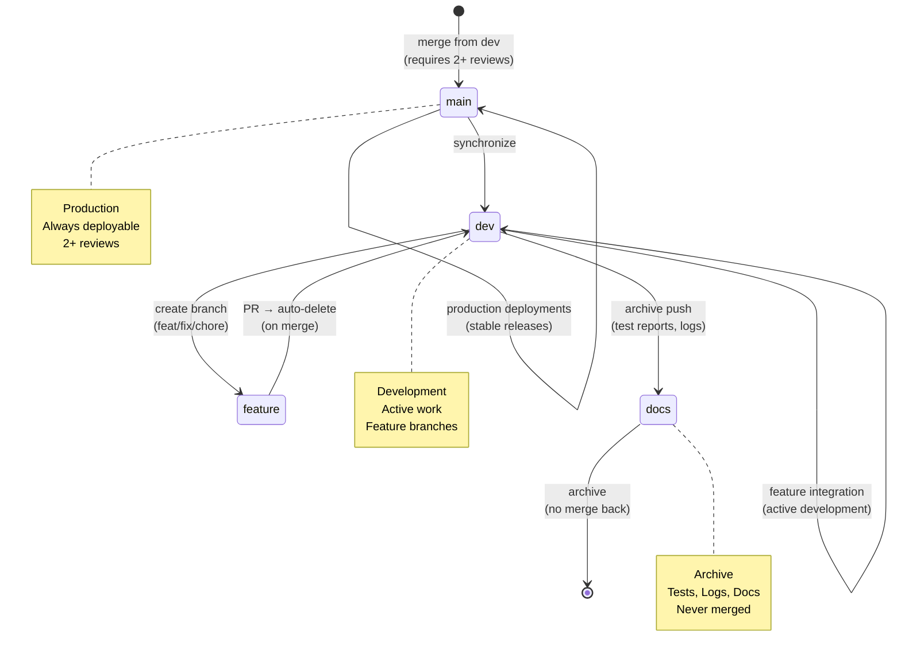

# Repository State



## Current State
- **Branch**: `dev`
- **Total Branches**: 2
- **Uncommitted Changes**: 0

## Recent Commits
```
d676506 Remove feature branch auto-cleanup workflow
5a338dd chore(visuals): auto-update architecture and repo state diagrams
409c214 fix(code-review): remove unused variables from API route and script
4553305 chore: resolve merge conflicts in docs and routes, normalize headings and schemas
5c0c2d7 chore(docs): improve formatting and clarity in PNPM enforcement guide
b5181bc feat(api): add backup endpoint for system backups
bd864c9 chore: remove duplicate backup route pre-merge cleanup
739086e fi
```
