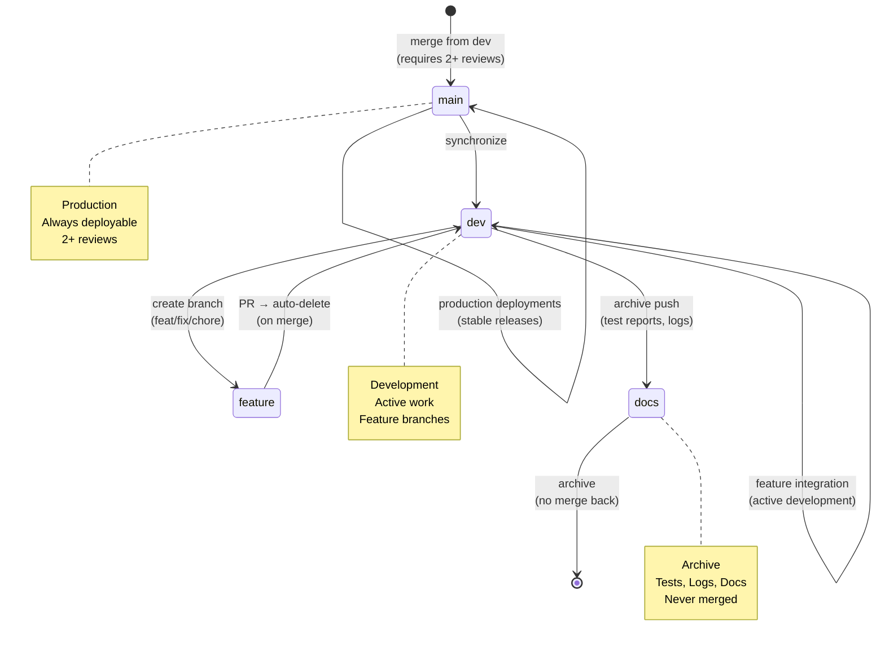

# Repository State



## Current State
- **Branch**: `main`
- **Total Branches**: 2
- **Uncommitted Changes**: 0

## Recent Commits
```
79511cd Delete .github/workflows/ci.yml
a1c81c9 chore(visuals): update index and metadata
ce54ece Delete .github/workflows/main-merge-gate.yml
8011781 chore(visuals): update index and metadata
f263a0b Delete .github/workflows/feature-branch-cleanup.yml
a35bb0c Delete .github/workflows/docs-archive-guard.yml
43b72f6 Delete .github/workflows/branch-file-validator.yml
866b931 chore(visuals): update index and metadata
c337492 chore(visuals): auto-update architecture and repo state diagrams
fe60df2 f
```
