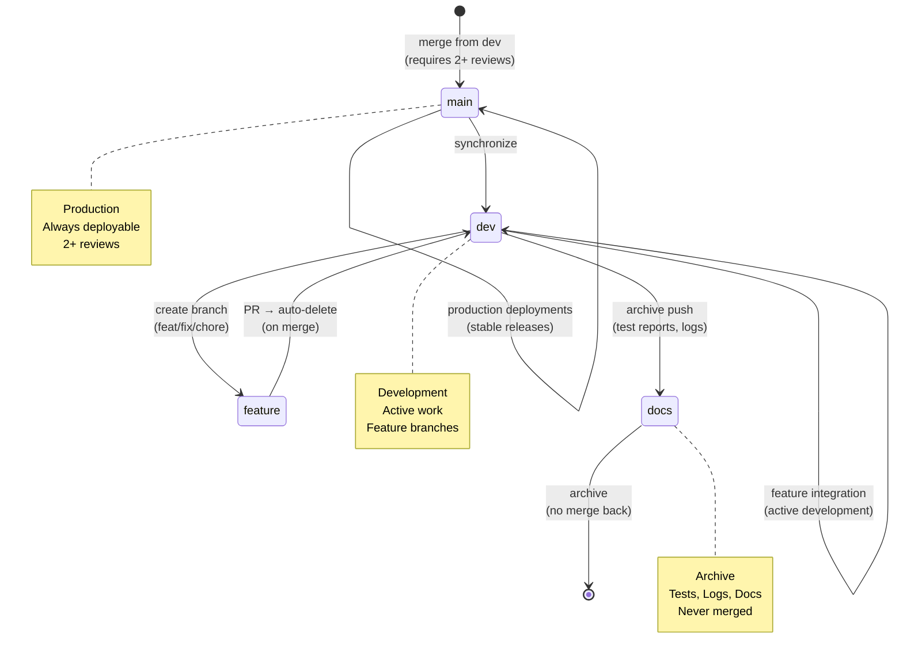

# Repository State



## Current State
- **Branch**: `dev`
- **Total Branches**: 2
- **Uncommitted Changes**: 0

## Recent Commits
```
0fdac1a Merge pull request #135 from peteywee/fix/triad-remediation
4c47d8c fix(api): standardize header for batch route (P0)
91f39fa Merge pull request #133 from peteywee/copilot/sub-pr-130
6aa633e fix(tests): enhance batch route tests with additional scenarios and validation
820dd77 fix(api): secure batch API with createOrgEndpoint + local schema
c8c3455 fix(api): use createOrgEndpoint for batch route with manager role
0915b29 fix(api): add local batch input schema and use createAuthenticatedE
```
