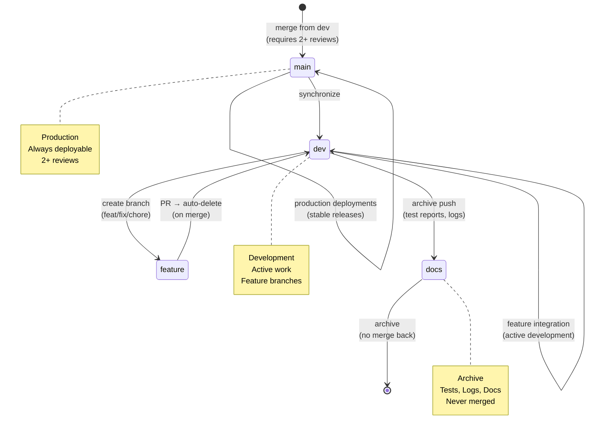

# Repository State



## Current State
- **Branch**: `dev`
- **Total Branches**: 2
- **Uncommitted Changes**: 0

## Recent Commits
```
0058f05 Merge pull request #130 from peteywee/chore/docs-consolidation
1b20227 Delete main branch merge gate workflow
8186a7e docs(memory): add TypeScript schema pattern memory and cross-reference to monorepo guide
eb07841 fix(tier-0): add Zod input validation to 6 API routes and integrate pattern validator into CI
9946470 feat(v1.3.0): agent system consolidation with master contract and unified documentation
3964e62 chore(docs): consolidate documentation into organized subdirectories
48cbbe7 fi
```
