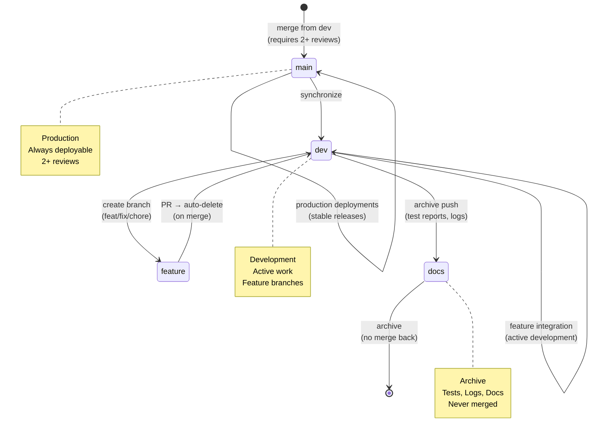

# Repository State



## Current State
- **Branch**: `main`
- **Total Branches**: 2
- **Uncommitted Changes**: 0

## Recent Commits
```
45995bb docs(ci): add remediation report and new CI workflow
dc983b1 chore(ci): remove broken Series A CI workflow
4587a3d fix(web): remove redundant middleware.ts (Next.js 16 uses proxy.ts)
534ba2d fix(ci): make visuals workflow gracefully handle permission limits
505315f fix(ci): resolve workflow failures
e45d4d4 fix(lint): suppress explicit-any warning for Timestamp type
a764b49 fix(security): resolve all 9 vulnerabilities (CVE fixes)
6e16dee feat(api-framework): SDK enhancements for main bra
```
