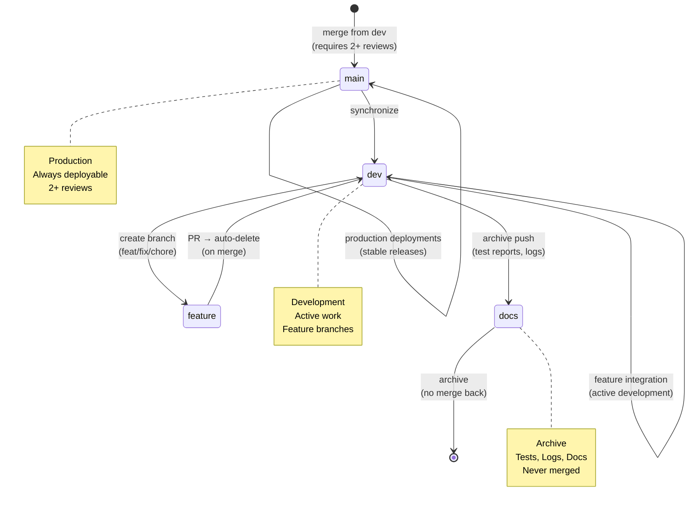

# Repository State



## Current State
- **Branch**: `main`
- **Total Branches**: 2
- **Uncommitted Changes**: 0

## Recent Commits
```
6a07b31 refactor: rename variables for consistency and clarity across the codebase
5442249 chore(visuals): update index and metadata
604e275 chore(visuals): auto-update architecture and repo state diagrams
2b62c2e fix(config): update eslint and tsconfig to properly handle test files
0dec425 fix(lint): install and configure eslint, prettier, markdownlint - repair formatting across codebase
d2be8c6 chore(visuals): update index and metadata
2dcc3ea chore(visuals): auto-update architecture and repo 
```
