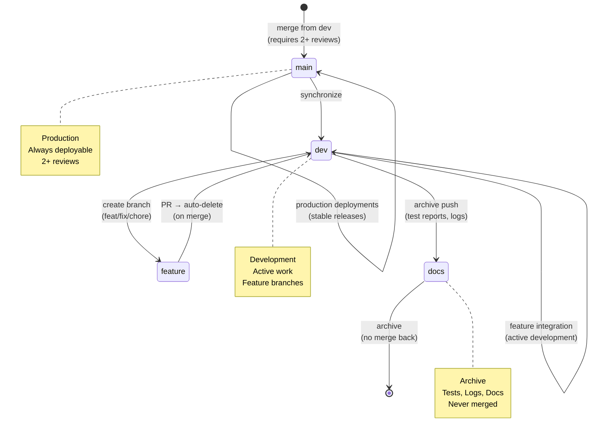

# Repository State



## Current State
<<<<<<< HEAD
- **Branch**: `main`
=======
- **Branch**: `dev`
>>>>>>> origin/dev
- **Total Branches**: 2
- **Uncommitted Changes**: 0

## Recent Commits
```
<<<<<<< HEAD
fe60df2 feat: complete SDK factory migration and add memory preservation system
8f5b829 feat(sdk): achieve 100% adoption and create indexable context documentation
b5e1c84 docs(memory): add Pattern Protocol institutional knowledge
2f16f81 feat(sdk): add comprehensive usage guide and code quality integration
8ff5d2f chore(visuals): update index and metadata
ea158f0 chore(visuals): auto-update architecture and repo state diagrams
214df7a refactor: rename variables for consistency across schedule a
=======
11286fc Merge pull request #138 from peteywee/fix/triad-remediation
d08a70c test(batch): enhance tests with authenticated requests and timeout handling
6eabb04 chore(visuals): update index and metadata
05a6ab8 chore(visuals): auto-update architecture and repo state diagrams
f567860 chore(tests): resolve merge conflict in batch route tests during merge from fix/triad-remediation-quickpush
5156900 chore(visuals): update index and metadata
89e455b chore(visuals): auto-update architecture and repo s
>>>>>>> origin/dev
```
