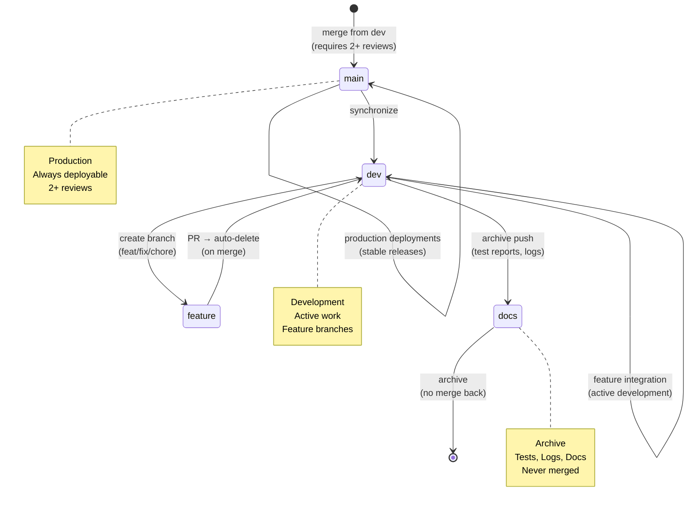

# Repository State



## Current State
- **Branch**: `main`
- **Total Branches**: 2
- **Uncommitted Changes**: 2

## Recent Commits
```
2b62c2e fix(config): update eslint and tsconfig to properly handle test files
0dec425 fix(lint): install and configure eslint, prettier, markdownlint - repair formatting across codebase
d2be8c6 chore(visuals): update index and metadata
2dcc3ea chore(visuals): auto-update architecture and repo state diagrams
f1b4e0d chore(report): update pattern validation report for API route header check
e7e285c chore(docs): merge production docs from docs/production-sync-from-dev
14cec52 chore(docs): promote p
```
