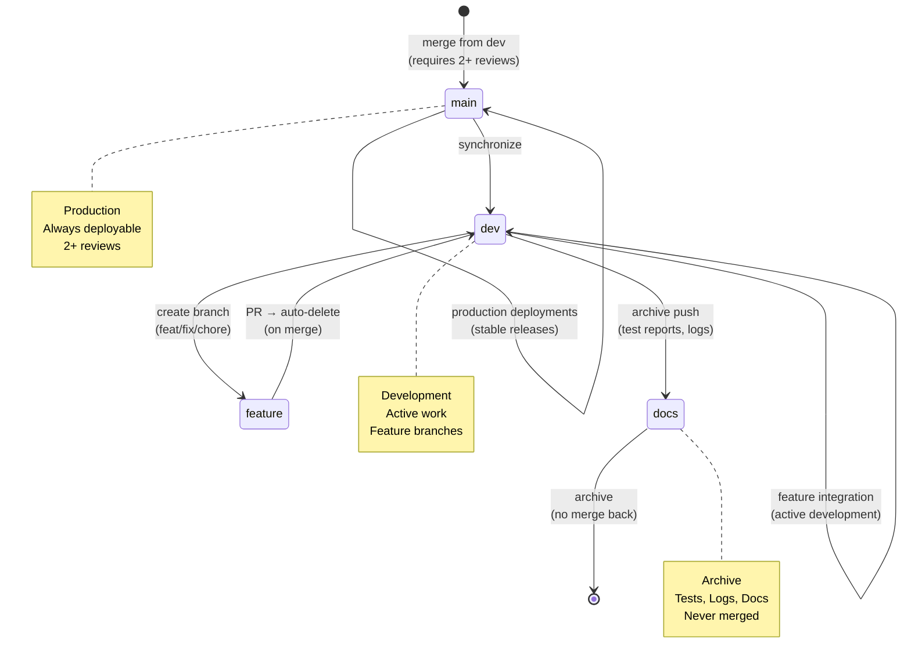

# Repository State



## Current State
- **Branch**: `dev`
- **Total Branches**: 2
- **Uncommitted Changes**: 0

## Recent Commits
```
0676386 test(batch): sync local test updates for batch route
6370fa7 chore(visuals): update index and metadata
79b50ff chore(visuals): auto-update architecture and repo state diagrams
da21c49 Merge pull request #129 from peteywee:fix/triad-remediation-quickpush
bef059a test(batch): update tests for timeout behavior
c37c8a4 chore(remediation): apply pending route and schema updates, header fixes
47d0abc chore(types): add standard header tags to schema files
dc32496 fix(onboarding): add Zod input 
```
