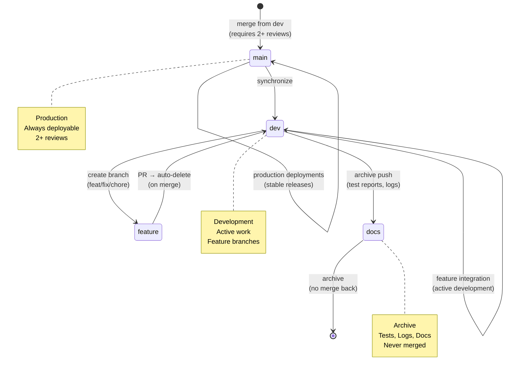

# Repository State



## Current State

- **Branch**: `main`
- **Total Branches**: 2
- **Uncommitted Changes**: 0

## Recent Commits

```
f1b4e0d chore(report): update pattern validation report for API route header check
e7e285c chore(docs): merge production docs from docs/production-sync-from-dev
14cec52 chore(docs): promote production docs from dev into branch for main PR
45995bb docs(ci): add remediation report and new CI workflow
dc983b1 chore(ci): remove broken Series A CI workflow
4587a3d fix(web): remove redundant middleware.ts (Next.js 16 uses proxy.ts)
534ba2d fix(ci): make visuals workflow gracefully handle permission li
```
