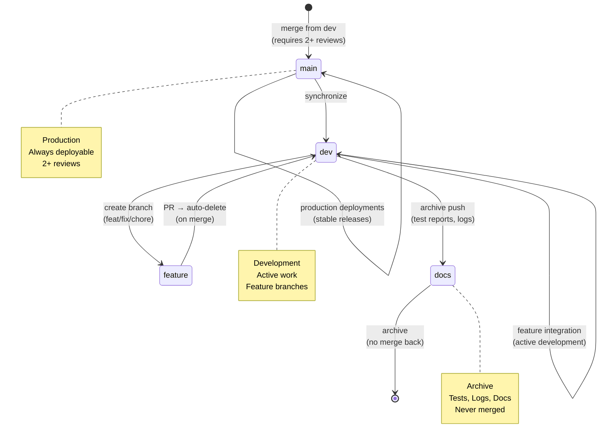

# Repository State



## Current State
- **Branch**: `dev`
- **Total Branches**: 2
- **Uncommitted Changes**: 0

## Recent Commits
```
f567860 chore(tests): resolve merge conflict in batch route tests during merge from fix/triad-remediation-quickpush
5156900 chore(visuals): update index and metadata
89e455b chore(visuals): auto-update architecture and repo state diagrams
1cbfe5d chore: save work before rebase
17615f8 chore(types): resolve leftover merge markers in internal and session schemas
87fdee6 chore(visuals): update index and metadata
23c7406 chore(visuals): auto-update architecture and repo state diagrams
0676386 test(b
```
