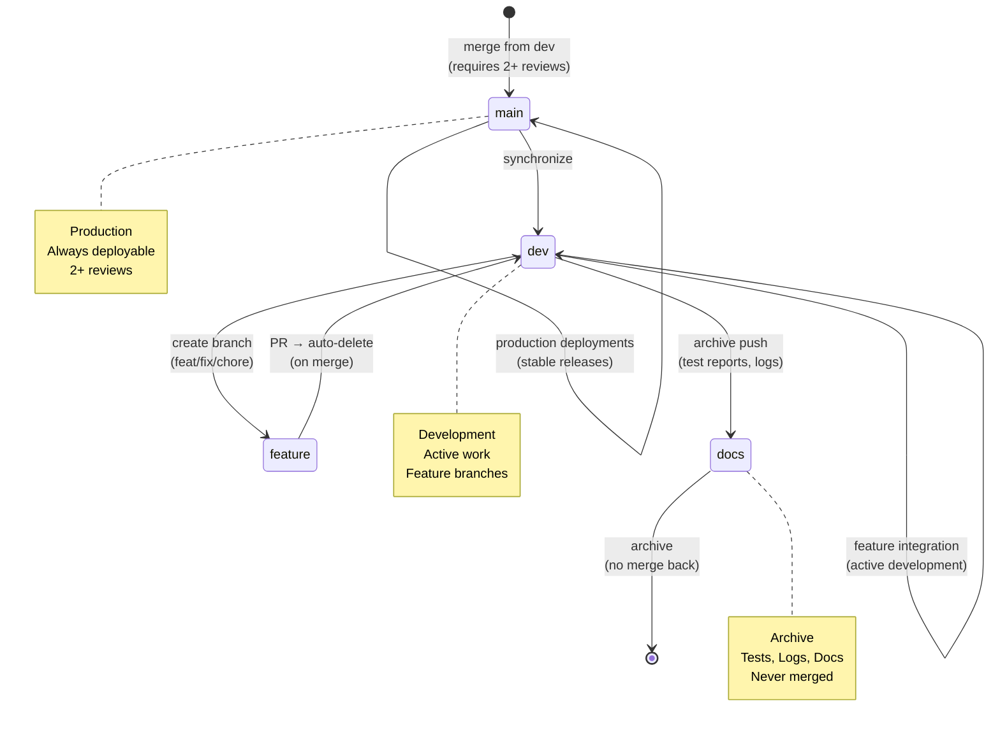

---

title: "Repository State Diagram"
description: "Visual state machine diagram showing repository organization and workflow states"
keywords:
  - repository
  - state-diagram
  - visual
  - workflow
  - organization
category: "report"
status: "active"
audience:
  - developers
  - operators
related-docs:
  - FILE\_DISTRIBUTION.md
  - ../INDEX.md
createdAt: "2026-01-31T07:19:03Z"
lastUpdated: "2026-01-31T07:19:03Z"

---

# Repository State



## Current State

- **Branch**: `main`
- **Total Branches**: 10
- **Uncommitted Changes**: 9

## Recent Commits

```
34cd13e chore: update TypeScript and Vitest versions, migrate ESLint ignore rules to config, and remove obsolete .eslintignore file
637d11c fix(lint): implement ESLint flat config monorepo solution
946f6f7 chore(visuals): update index and metadata
b8afb4e chore(visuals): update index and metadata
79511cd Delete .github/workflows/ci.yml
a1c81c9 chore(visuals): update index and metadata
ce54ece Delete .github/workflows/main-merge-gate.yml
8011781 chore(visuals): update index and metadata
f263a0b D
```
