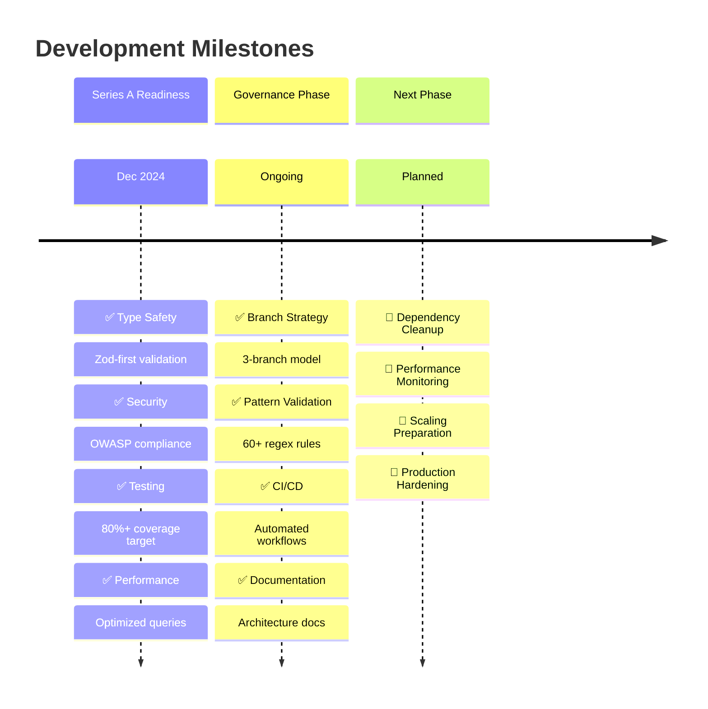

# Project Status Timeline

## Status Summary
- **Overall Health**: ✅ PRODUCTION-READY
- **Type Safety**: ✅ Strict mode enforced
- **Security**: ✅ OWASP compliant
- **Testing**: ✅ 80%+ target
- **Performance**: ✅ Optimized
- **Governance**: ✅ 3-branch system active
