# Project Status Timeline

```mermaid
timeline
    title Development Milestones

    section Series A Readiness
        Dec 2024: ✅ Type Safety: Zod-first validation
                : ✅ Security: OWASP compliance
                : ✅ Testing: 80%+ coverage target
                : ✅ Performance: Optimized queries

    section Governance Phase
        Ongoing: ✅ Branch Strategy: 3-branch model
               : ✅ Pattern Validation: 60+ regex rules
               : ✅ CI/CD: Automated workflows
               : ✅ Documentation: Architecture docs

    section Next Phase
        Planned: 🔄 Dependency Cleanup
               : 🔄 Performance Monitoring
               : 🔄 Scaling Preparation
               : 🔄 Production Hardening
```

## Status Summary
- **Overall Health**: ✅ PRODUCTION-READY
- **Type Safety**: ✅ Strict mode enforced
- **Security**: ✅ OWASP compliant
- **Testing**: ✅ 80%+ target
- **Performance**: ✅ Optimized
- **Governance**: ✅ 3-branch system active
